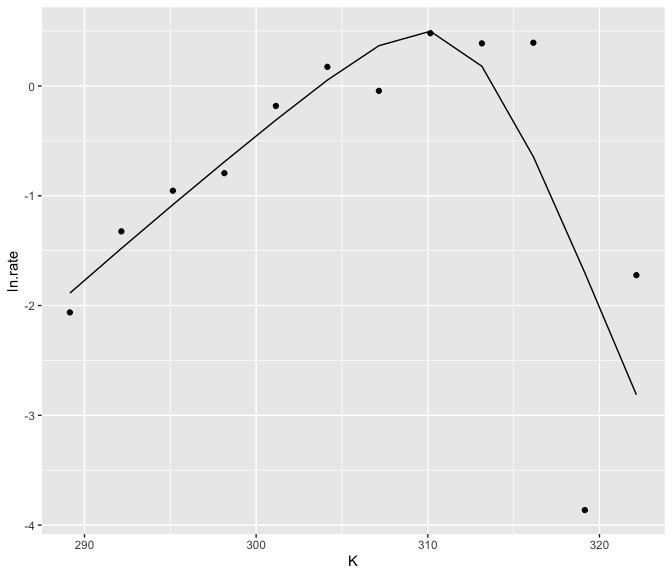
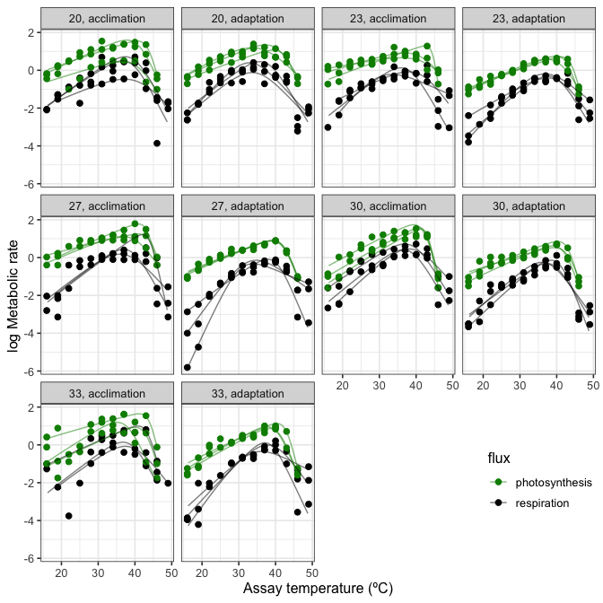
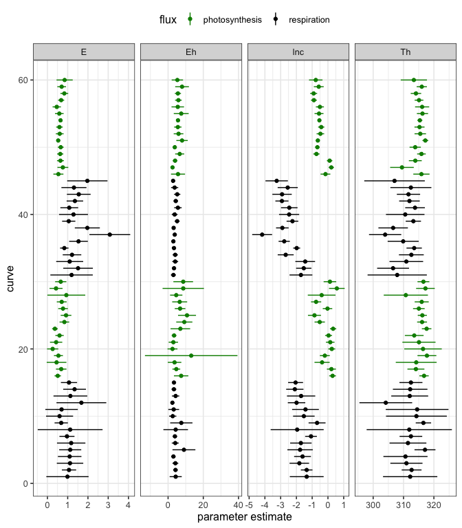

<!-- README.md is generated from README.Rmd. Please edit that file -->

## nls.multstart

Robust and reproducible non-linear regression in R

### Authors and maintainers

Daniel Padfield: <d.padfield@exeter.ac.uk>

Granville Matheson: <mathesong@gmail.com>

### Issues and suggestions

Please report any issues/suggestions for improvement in the [issues
link](https://github.com/padpadpadpad/nls.multstart/issues) for the
repository. Or please email <d.padfield@exeter.ac.uk> or
<mathesong@gmail.com>.

<!-- badges: start -->

[](https://github.com/padpadpadpad/nls.multstart/actions/workflows/R-CMD-check.yaml)
[](https://cran.r-project.org/package=nls.multstart)
[](https://www.r-pkg.org/pkg/nls.multstart)
<!-- badges: end -->

### Licensing

This package is licensed under GPL-3.

### Overview

**nls.multstart** is an R package that allows more robust and
reproducible non-linear regression compared to **nls()** or **nlsLM()**.
These functions allow only a single starting value, meaning that it can
be hard to get the best estimated model. This is especially true if the
same model is fitted over the levels of a factor, which may have the
same shape of curve, but be much different in terms of parameter
estimates.

**nls_multstart()** is the main (currently only) function of
**nls.multstart**. Similar to the R package **nls2**, it allows multiple
starting values for each parameter and then iterates through multiple
starting values, attempting a fit with each set of start parameters. The
best model is then picked on AIC score. This results in a more
reproducible and reliable method of fitting non-linear least squares
regression in R.

This package is designed to work with the **tidyverse**, harnessing the
functions within **broom**, **tidyr**, **dplyr** and **purrr** to
extract estimates and plot things easily with **ggplot2**. A slightly
less tidy-friendly implementation is
[**nlsLoop**](https://github.com/padpadpadpad/nlsLoop).

### Installation and examples

#### 1. Installation

**nls.multstart** can be installed from CRAN using
**install.packages()** or GitHub can be installed using **devtools**.

``` r
# install package
install.packages('nls.multstart') # from CRAN
devtools::install_github("padpadpadpad/nls.multstart") # from GitHub
```

#### 2. Run nls_multstart()

**nls_multstart()** can be used to do non-linear regression on a single
curve.

``` r

# load in nlsLoop and other packages
library(nls.multstart)
library(ggplot2)
library(broom)
library(purrr)
library(dplyr)
library(tidyr)
library(nlstools)

# load in example data set
data("Chlorella_TRC")

# define the Sharpe-Schoolfield equation
schoolfield_high <- function(lnc, E, Eh, Th, temp, Tc) {
  Tc <- 273.15 + Tc
  k <- 8.62e-5
  boltzmann.term <- lnc + log(exp(E/k*(1/Tc - 1/temp)))
  inactivation.term <- log(1/(1 + exp(Eh/k*(1/Th - 1/temp))))
  return(boltzmann.term + inactivation.term)
  }
```

``` r
# subset dataset
d_1 <- subset(Chlorella_TRC, curve_id == 1)

# run nls_multstart with shotgun approach
fit <- nls_multstart(ln.rate ~ schoolfield_high(lnc, E, Eh, Th, temp = K, Tc = 20),
                     data = d_1,
                     iter = 250,
                     start_lower = c(lnc=-10, E=0.1, Eh=0.5, Th=285),
                     start_upper = c(lnc=10, E=2, Eh=5, Th=330),
                     supp_errors = 'Y',
                     convergence_count = 100,
                     na.action = na.omit,
                     lower = c(lnc = -10, E = 0, Eh = 0, Th = 0))

fit
#> Nonlinear regression model
#>   model: ln.rate ~ schoolfield_high(lnc, E, Eh, Th, temp = K, Tc = 20)
#>    data: data
#>      lnc        E       Eh       Th 
#>  -1.3462   0.9877   4.3326 312.1887 
#>  residual sum-of-squares: 7.257
#> 
#> Number of iterations to convergence: 14 
#> Achieved convergence tolerance: 1.49e-08
```

This method uses a random-search/shotgun approach to fit multiple
curves. Random start parameter values are picked from a uniform
distribution between `start_lower()` and `start_upper()` for each
parameter. If the best model is not improved upon (in terms of AIC
score) for 100 new start parameter combinations, the function will
return that model fit. This is controlled by `convergence_count`, if
this is set to `FALSE`, **nls_multstart()** will try and fit all
iterations.

Another method of model fitting available in **nls_multstart()** is a
gridstart approach. This method creates a combination of start
parameters, equally spaced across each of the starting parameter bounds.
This can be specified with a vector of the same length as the number of
parameters, `c(5, 5, 5)` for 3 estimated parameters will yield 125
iterations.

``` r
# run nls_multstart with gridstart approach
fit <- nls_multstart(ln.rate ~ schoolfield_high(lnc, E, Eh, Th, temp = K, Tc = 20),
                     data = d_1,
                     iter = c(5, 5, 5, 5),
                     start_lower = c(lnc=-10, E=0.1, Eh=0.5, Th=285),
                     start_upper = c(lnc=10, E=2, Eh=5, Th=330),
                     supp_errors = 'Y',
                     na.action = na.omit,
                     lower = c(lnc = -10, E = 0, Eh = 0, Th = 0))

fit
#> Nonlinear regression model
#>   model: ln.rate ~ schoolfield_high(lnc, E, Eh, Th, temp = K, Tc = 20)
#>    data: data
#>      lnc        E       Eh       Th 
#>  -1.3462   0.9877   4.3326 312.1887 
#>  residual sum-of-squares: 7.257
#> 
#> Number of iterations to convergence: 17 
#> Achieved convergence tolerance: 1.49e-08
```

Reassuringly both methods give identical model fits!

#### 3. Clean up fit

This fit can then be tidied up in various ways using the R package
**broom**. Each different function in **broom** returns a different set
of information. **tidy()** returns the estimated parameters,
**augment()** returns the predictions and **glance()** returns
information about the model such as AIC score. Confidence intervals of
non-linear regression can also be estimated using
**nlstools::confint2()**

``` r
# get info
info <- glance(fit)
info
#> # A tibble: 1 × 9
#>   sigma isConv       finTol logLik   AIC   BIC deviance df.residual  nobs
#>   <dbl> <lgl>         <dbl>  <dbl> <dbl> <dbl>    <dbl>       <int> <int>
#> 1 0.952 TRUE   0.0000000149  -14.0  38.0  40.4     7.26           8    12

# get params
params <- tidy(fit)

# get confidence intervals using nlstools
CI <- confint2(fit) %>%
  data.frame() %>%
  rename(., conf.low = X2.5.., conf.high = X97.5..)

# bind params and confidence intervals
params <- bind_cols(params, CI)
select(params, -c(statistic, p.value))
#> # A tibble: 4 × 5
#>   term  estimate std.error conf.low conf.high
#>   <chr>    <dbl>     <dbl>    <dbl>     <dbl>
#> 1 lnc     -1.35      0.466  -2.42      -0.272
#> 2 E        0.988     0.452  -0.0549     2.03 
#> 3 Eh       4.33      1.49    0.902      7.76 
#> 4 Th     312.        3.88  303.       321.

# get predictions
preds <- augment(fit)
preds
#> # A tibble: 12 × 5
#>    ln.rate     K `(weights)` .fitted  .resid
#>      <dbl> <dbl>       <dbl>   <dbl>   <dbl>
#>  1 -2.06    289.           1 -1.89   -0.176 
#>  2 -1.32    292.           1 -1.48    0.156 
#>  3 -0.954   295.           1 -1.08    0.127 
#>  4 -0.794   298.           1 -0.691  -0.103 
#>  5 -0.182   301.           1 -0.311   0.129 
#>  6  0.174   304.           1  0.0534  0.121 
#>  7 -0.0446  307.           1  0.367  -0.411 
#>  8  0.481   310.           1  0.498  -0.0179
#>  9  0.388   313.           1  0.180   0.208 
#> 10  0.394   316.           1 -0.645   1.04  
#> 11 -3.86    319.           1 -1.70   -2.16  
#> 12 -1.72    322.           1 -2.81    1.09
```

#### 4. Plot fit

The predictions can then easily be plotted alongside the actual data.

``` r

ggplot() +
  geom_point(aes(K, ln.rate), d_1) +
  geom_line(aes(K, .fitted), preds)
```

<!-- -->

#### 5. Fitting over levels of a factor with nls_multstart

**nls_multstart()** is unlikely to speed you up very much if only one
curve is fitted. However, if you have 10, 60 or 100s of curves to fit,
it makes sense that at least some of them may not fit with the same
starting parameters, no matter how many iterations it is run for.

This is where **nls_multstart()** can help. Multiple models can be
fitted using **purrr**, **dplyr** and **tidyr**. These fits can then be
tidied using **broom**, an approach Hadley Wickham has previously
[written about](https://blog.rstudio.com/2016/02/02/tidyr-0-4-0/).

``` r
# fit over each set of groupings
fits <- Chlorella_TRC %>%
  group_by(., flux, growth.temp, process, curve_id) %>%
  nest() %>%
  mutate(fit = purrr::map(data, ~ nls_multstart(ln.rate ~ schoolfield_high(lnc, E, Eh, Th, temp = K, Tc = 20),
                                   data = .x,
                                   iter = 1000,
                                   start_lower = c(lnc=-1000, E=0.1, Eh=0.5, Th=285),
                                   start_upper = c(lnc=1000, E=2, Eh=10, Th=330),
                                   supp_errors = 'Y',
                                   na.action = na.omit,
                                   lower = c(lnc = -10, E = 0, Eh = 0, Th = 0))))
```

A single fit can check to make sure it looks ok. Looking at `fits`
demonstrates that there is now a `fit` list column containing each of
the non-linear fits for each combination of our grouping variables.

``` r
# look at output object
select(fits, curve_id, data, fit)
#> Adding missing grouping variables: `flux`, `growth.temp`, `process`
#> # A tibble: 60 × 6
#> # Groups:   flux, growth.temp, process, curve_id [60]
#>    flux        growth.temp process     curve_id data              fit   
#>    <chr>             <dbl> <chr>          <dbl> <list>            <list>
#>  1 respiration          20 acclimation        1 <tibble [12 × 3]> <nls> 
#>  2 respiration          20 acclimation        2 <tibble [12 × 3]> <nls> 
#>  3 respiration          23 acclimation        3 <tibble [12 × 3]> <nls> 
#>  4 respiration          27 acclimation        4 <tibble [9 × 3]>  <nls> 
#>  5 respiration          27 acclimation        5 <tibble [12 × 3]> <nls> 
#>  6 respiration          30 acclimation        6 <tibble [12 × 3]> <nls> 
#>  7 respiration          30 acclimation        7 <tibble [12 × 3]> <nls> 
#>  8 respiration          33 acclimation        8 <tibble [10 × 3]> <nls> 
#>  9 respiration          33 acclimation        9 <tibble [8 × 3]>  <nls> 
#> 10 respiration          20 acclimation       10 <tibble [10 × 3]> <nls> 
#> # ℹ 50 more rows

# look at a single fit
summary(fits$fit[[1]])
#> 
#> Formula: ln.rate ~ schoolfield_high(lnc, E, Eh, Th, temp = K, Tc = 20)
#> 
#> Parameters:
#>     Estimate Std. Error t value Pr(>|t|)    
#> lnc  -1.3462     0.4656  -2.891   0.0202 *  
#> E     0.9877     0.4521   2.185   0.0604 .  
#> Eh    4.3326     1.4878   2.912   0.0195 *  
#> Th  312.1887     3.8782  80.499 6.32e-13 ***
#> ---
#> Signif. codes:  0 '***' 0.001 '**' 0.01 '*' 0.05 '.' 0.1 ' ' 1
#> 
#> Residual standard error: 0.9524 on 8 degrees of freedom
#> 
#> Number of iterations to convergence: 13 
#> Achieved convergence tolerance: 1.49e-08
```

#### 6. Clean up multiple fits

These fits can be cleaned up in a similar way to the single fit, but
this time **purrr::map()** iterates the **broom** function over the
grouping variables.

``` r
# get summary
info <- fits %>%
  mutate(summary = map(fit, glance)) %>%
  unnest(summary)

# get params
params <- fits %>%
  mutate(., p = map(fit, tidy)) %>%
  unnest(p)

# get confidence intervals
CI <- fits %>%
  mutate(., cis = map(fit, confint2),
         cis = map(cis, data.frame)) %>%
  unnest(cis) %>%
  rename(., conf.low = X2.5.., conf.high = X97.5..) %>%
  group_by(., curve_id) %>%
  mutate(., term = c('lnc', 'E', 'Eh', 'Th')) %>%
  ungroup() %>%
  select(., -data, -fit)

# merge parameters and CI estimates
params <- merge(params, CI, by = intersect(names(params), names(CI)))

# get predictions
preds <- fits %>%
  mutate(., p = map(fit, augment)) %>%
  unnest(p)
```

Looking at **info** allows us to see if all the models converged.

``` r
select(info, curve_id, logLik, AIC, BIC, deviance, df.residual)
#> Adding missing grouping variables: `flux`, `growth.temp`, `process`
#> # A tibble: 60 × 9
#> # Groups:   flux, growth.temp, process, curve_id [60]
#>    flux    growth.temp process curve_id  logLik   AIC   BIC deviance df.residual
#>    <chr>         <dbl> <chr>      <dbl>   <dbl> <dbl> <dbl>    <dbl>       <int>
#>  1 respir…          20 acclim…        1 -14.0   38.0  40.4     7.26            8
#>  2 respir…          20 acclim…        2  -1.20  12.4  14.8     0.858           8
#>  3 respir…          23 acclim…        3  -7.39  24.8  27.2     2.41            8
#>  4 respir…          27 acclim…        4  -0.523 11.0  12.0     0.592           5
#>  5 respir…          27 acclim…        5 -10.8   31.7  34.1     4.29            8
#>  6 respir…          30 acclim…        6  -8.52  27.0  29.5     2.91            8
#>  7 respir…          30 acclim…        7  -1.29  12.6  15.0     0.871           8
#>  8 respir…          33 acclim…        8 -13.4   36.7  38.2     8.48            6
#>  9 respir…          33 acclim…        9   1.82   6.36  6.76    0.297           4
#> 10 respir…          20 acclim…       10  -1.27  12.5  14.1     0.755           6
#> # ℹ 50 more rows
```

#### 7. Plotting predictions

When plotting non-linear fits, it often looks better to have a smooth
curve, even if there are not many points underlying the fit. This can be
achieved by including `newdata` in the **augment()** function and
creating a higher resolution set of predictor values.

However, when predicting for many different fits, it is not certain that
each curve has the same range of predictor variables. Consequently, we
need to filter each new prediction by the **min()** and **max()** of the
predictor variables.

``` r
# new data frame of predictions
new_preds <- Chlorella_TRC %>%
  do(., data.frame(K = seq(min(.$K), max(.$K), length.out = 150), stringsAsFactors = FALSE))

# max and min for each curve
max_min <- group_by(Chlorella_TRC, curve_id) %>%
  summarise(., min_K = min(K), max_K = max(K)) %>%
  ungroup()

# create new predictions
preds2 <- fits %>%
  mutate(., p = map(fit, augment, newdata = new_preds)) %>%
  unnest(p) %>%
  merge(., max_min, by = 'curve_id') %>%
  group_by(., curve_id) %>%
  filter(., K > unique(min_K) & K < unique(max_K)) %>%
  rename(., ln.rate = .fitted) %>%
  ungroup()
```

These can then be plotted using **ggplot2**.

``` r
# plot
ggplot() +
  geom_point(aes(K - 273.15, ln.rate, col = flux), size = 2, Chlorella_TRC) +
  geom_line(aes(K - 273.15, ln.rate, col = flux, group = curve_id), alpha = 0.5, preds2) +
  facet_wrap(~ growth.temp + process, labeller = labeller(.multi_line = FALSE)) +
  scale_colour_manual(values = c('green4', 'black')) +
  theme_bw(base_size = 12) +
  ylab('log Metabolic rate') +
  xlab('Assay temperature (ºC)') +
  theme(legend.position = c(0.9, 0.15))
```

<!-- -->

#### 8. Plotting confidence intervals

The confidence intervals of each parameter for each curve fit can also
be easily visualised.

``` r
# plot
ggplot(params, aes(col = flux)) +
  geom_point(aes(curve_id, estimate)) +
  facet_wrap(~ term, scale = 'free_x', ncol = 4) +
  geom_linerange(aes(curve_id, ymin = conf.low, ymax = conf.high)) +
  coord_flip() +
  scale_color_manual(values = c('green4', 'black')) +
  theme_bw(base_size = 12) +
  theme(legend.position = 'top') +
  xlab('curve') +
  ylab('parameter estimate')
```

<!-- -->
