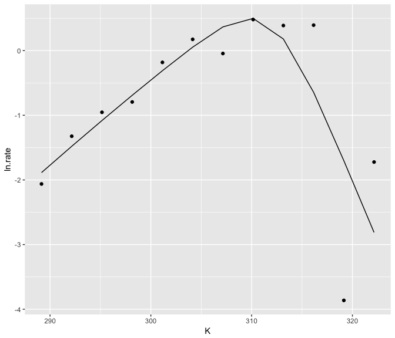
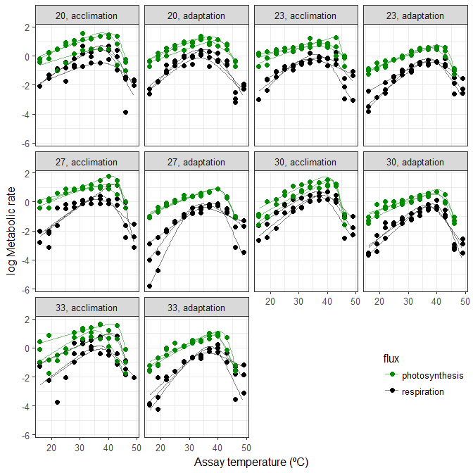
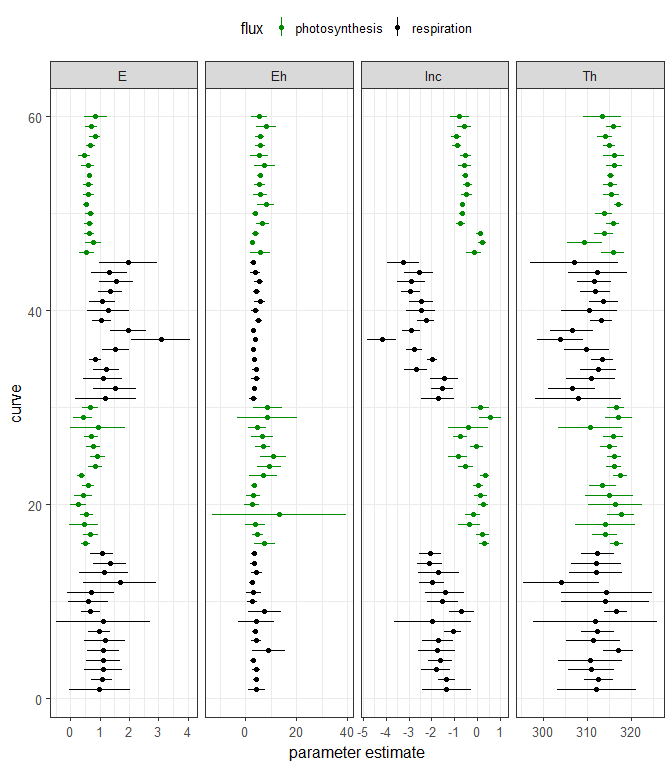

<!-- README.md is generated from README.Rmd. Please edit that file -->
nls.multstart
-------------

Robust and reproducible non-linear regression in R

### Authors and maintainers

Daniel Padfield: <d.padfield@exeter.ac.uk>

Granville Matheson: <mathesong@gmail.com>

### Issues and suggestions

Please report any issues/suggestions for improvement in the [issues link](https://github.com/padpadpadpad/nls.multstart/issues) for the repository. Or please email <d.padfield@exeter.ac.uk> or <mathesong@gmail.com>.

[](https://travis-ci.org/padpadpadpad/nls.multstart)

### Licensing

This package is licensed under GPL-3.

### Overview

**nls.multstart** is an R package that allows more robust and reproducible non-linear regression compared to **nls()** or **nlsLM()**. These functions allow only a single starting value, meaning that it can be hard to get the best estimated model. This is especially true if the same model is fitted over the levels of a factor, which may have the same shape of curve, but be much different in terms of parameter estimates.

**nls\_multstart()** is the main (currently only) function of **nls.multstart**. Similar to the R package **nls2**, it allows multiple starting values for each parameter and then iterates through multiple starting values, attempting a fit with each set of start parameters. The best model is then picked on AIC score. This results in a more reproducible and reliable method of fitting non-linear least squares regression in R.

This package is designed to work with the **tidyverse**, harnessing the functions within **broom**, **tidyr**, **dplyr** and **purrr** to extract estimates and plot things easily with **ggplot2**. A slightly less tidy-friendly implementation is [**nlsLoop**](https://github.com/padpadpadpad/nlsLoop).

### Installation and examples

#### 1. Installation

R packages in GitHub can be installed using **devtools**.

``` r
# install package
devtools::install_github("padpadpadpad/nls.multstart")
```

#### 2. Run nls\_multstart()

**nls\_multstart()** can be used to do non-linear regression on a single curve

``` r

# load in nlsLoop and other packages
library(nls.multstart)
library(ggplot2)
library(broom)
library(purrr)
library(dplyr)
library(tidyr)
library(nlstools)

# load in example data set
data("Chlorella_TRC")

# define the Sharpe-Schoolfield equation
schoolfield_high <- function(lnc, E, Eh, Th, temp, Tc) {
  Tc <- 273.15 + Tc
  k <- 8.62e-5
  boltzmann.term <- lnc + log(exp(E/k*(1/Tc - 1/temp)))
  inactivation.term <- log(1/(1 + exp(Eh/k*(1/Th - 1/temp))))
  return(boltzmann.term + inactivation.term)
  }
```

``` r
# subset dataset
d_1 <- subset(Chlorella_TRC, curve_id == 1)

# run nls_multstart
fit <- nls_multstart(ln.rate ~ schoolfield_high(lnc, E, Eh, Th, temp = K, Tc = 20),
                     data = d_1,
                     iter = 250,
                     start_lower = c(-10, 0.1, 0.5, 285),
                     start_upper = c(10, 2, 5, 330),
                     supp_errors = 'Y',
                     na.action = na.omit,
                     lower = c(lnc = -10, E = 0, Eh = 0, Th = 0))

fit
#> Nonlinear regression model
#>   model: ln.rate ~ schoolfield_high(lnc, E, Eh, Th, temp = K, Tc = 20)
#>    data: data
#>      lnc        E       Eh       Th 
#>  -1.3462   0.9877   4.3326 312.1887 
#>  residual sum-of-squares: 7.257
#> 
#> Number of iterations to convergence: 17 
#> Achieved convergence tolerance: 1.49e-08
```

#### 3. Clean up fit

This fit can then be tidied up in various ways using the R package **broom**. Each different function in **broom** returns a different set of information. **tidy()** returns the estimated parameters, **augment()** returns the predictions and **glance()** returns information about the model such as AIC score. Confidence intervals of non-linear regression can also be estimated using **nlstools::confint2()**

``` r
# get info
info <- glance(fit)
info
#>       sigma isConv       finTol    logLik      AIC      BIC deviance
#> 1 0.9524198   TRUE 1.490116e-08 -14.00948 38.01896 40.44349 7.256827
#>   df.residual
#> 1           8

# get params
params <- tidy(fit)

# get confidence intervals using nlstools
CI <- confint2(fit) %>%
  data.frame() %>%
  rename(., conf.low = X2.5.., conf.high = X97.5..)

# bind params and confidence intervals
params <- bind_cols(params, CI)
select(params, -c(statistic, p.value))
#>   term    estimate std.error     conf.low   conf.high
#> 1  lnc  -1.3462105 0.4656398  -2.41997788  -0.2724432
#> 2    E   0.9877307 0.4521481  -0.05492464   2.0303860
#> 3   Eh   4.3326453 1.4877827   0.90181232   7.7634783
#> 4   Th 312.1887460 3.8781636 303.24568474 321.1318072

# get predictions
preds <- augment(fit)
preds
#>        ln.rate      K X.weights.     .fitted     .resid
#> 1  -2.06257833 289.15          1 -1.88694036 -0.1756380
#> 2  -1.32437939 292.15          1 -1.48002017  0.1556408
#> 3  -0.95416807 295.15          1 -1.08143502  0.1272669
#> 4  -0.79443675 298.15          1 -0.69121466 -0.1032221
#> 5  -0.18203642 301.15          1 -0.31058073  0.1285443
#> 6   0.17424007 304.15          1  0.05336433  0.1208757
#> 7  -0.04462754 307.15          1  0.36657463 -0.4112022
#> 8   0.48050690 310.15          1  0.49837150 -0.0178646
#> 9   0.38794188 313.15          1  0.17973802  0.2082039
#> 10  0.39365516 316.15          1 -0.64473313  1.0383883
#> 11 -3.86319577 319.15          1 -1.70300699 -2.1601888
#> 12 -1.72352435 322.15          1 -2.81272007  1.0891957
```

#### 4. Plot fit

The predictions can then easily be plotted alongside the actual data.

``` r

ggplot() +
  geom_point(aes(K, ln.rate), d_1) +
  geom_line(aes(K, .fitted), preds)
```



#### 5. Fitting over levels of a factor with nls\_multstart

**nls\_multstart()** is unlikely to speed you up very much if only one curve is fitted. However, if you have 10, 60 or 100s of curves to fit, it makes sense that at least some of them may not fit with the same starting parameters, no matter how many iterations it is run for.

This is where **nls\_multstart()** can help. Multiple models can be fitted using **purrr**, **dplyr** and **tidyr**. These fits can then be tidied using **broom**, an approach Hadley Wickham has previously [written about](https://blog.rstudio.com/2016/02/02/tidyr-0-4-0/).

``` r
# fit over each set of groupings
fits <- Chlorella_TRC %>%
  group_by(., flux, growth.temp, process, curve_id) %>%
  nest() %>%
  mutate(fit = purrr::map(data, ~ nls_multstart(ln.rate ~ schoolfield_high(lnc, E, Eh, Th, temp = K, Tc = 20),
                                   data = .x,
                                   iter = 1000,
                                   start_lower = c(-1000, 0.1, 0.5, 285),
                                   start_upper = c(1000, 2, 10, 330),
                                   supp_errors = 'Y',
                                   na.action = na.omit,
                                   lower = c(lnc = -10, E = 0, Eh = 0, Th = 0))))
```

A single fit can check to make sure it looks ok. Looking at `fits` demonstrates that there is now a `fit` list column containing each of the non-linear fits for each combination of our grouping variables.

``` r
# look at output object
select(fits, curve_id, data, fit)
#> # A tibble: 60 x 3
#>    curve_id data              fit      
#>       <dbl> <list>            <list>   
#>  1     1.00 <tibble [12 x 3]> <S3: nls>
#>  2     2.00 <tibble [12 x 3]> <S3: nls>
#>  3     3.00 <tibble [12 x 3]> <S3: nls>
#>  4     4.00 <tibble [9 x 3]>  <S3: nls>
#>  5     5.00 <tibble [12 x 3]> <S3: nls>
#>  6     6.00 <tibble [12 x 3]> <S3: nls>
#>  7     7.00 <tibble [12 x 3]> <S3: nls>
#>  8     8.00 <tibble [10 x 3]> <S3: nls>
#>  9     9.00 <tibble [8 x 3]>  <S3: nls>
#> 10    10.0  <tibble [10 x 3]> <S3: nls>
#> # ... with 50 more rows

# look at a single fit
summary(fits$fit[[1]])
#> 
#> Formula: ln.rate ~ schoolfield_high(lnc, E, Eh, Th, temp = K, Tc = 20)
#> 
#> Parameters:
#>     Estimate Std. Error t value Pr(>|t|)    
#> lnc  -1.3462     0.4656  -2.891   0.0202 *  
#> E     0.9877     0.4521   2.185   0.0604 .  
#> Eh    4.3326     1.4878   2.912   0.0195 *  
#> Th  312.1887     3.8782  80.499 6.32e-13 ***
#> ---
#> Signif. codes:  0 '***' 0.001 '**' 0.01 '*' 0.05 '.' 0.1 ' ' 1
#> 
#> Residual standard error: 0.9524 on 8 degrees of freedom
#> 
#> Number of iterations to convergence: 19 
#> Achieved convergence tolerance: 1.49e-08
```

#### 6. Clean up multiple fits

These fits can be cleaned up in a similar way to the single fit, but this time **purrr::map()** iterates the **broom** function over the grouping variables.

``` r
# get summary
info <- fits %>%
  unnest(fit %>% map(glance))

# get params
params <- fits %>%
  unnest(fit %>% map(tidy))

# get confidence intervals
CI <- fits %>% 
  unnest(fit %>% map(~ confint2(.x) %>%
  data.frame() %>%
  rename(., conf.low = X2.5.., conf.high = X97.5..))) %>%
  group_by(., curve_id) %>%
  mutate(., term = c('lnc', 'E', 'Eh', 'Th')) %>%
  ungroup()

# merge parameters and CI estimates
params <- merge(params, CI, by = intersect(names(params), names(CI)))

# get predictions
preds <- fits %>%
  unnest(fit %>% map(augment))
```

Looking at **info** allows us to see if all the models converged.

``` r
select(info, curve_id, logLik, AIC, BIC, deviance, df.residual)
#> # A tibble: 60 x 6
#>    curve_id  logLik   AIC   BIC deviance df.residual
#>       <dbl>   <dbl> <dbl> <dbl>    <dbl>       <int>
#>  1     1.00 -14.0   38.0  40.4     7.26            8
#>  2     2.00 - 1.20  12.4  14.8     0.858           8
#>  3     3.00 - 7.39  24.8  27.2     2.41            8
#>  4     4.00 - 0.523 11.0  12.0     0.592           5
#>  5     5.00 -10.8   31.7  34.1     4.29            8
#>  6     6.00 - 8.52  27.0  29.5     2.91            8
#>  7     7.00 - 1.29  12.6  15.0     0.871           8
#>  8     8.00 -13.4   36.7  38.2     8.48            6
#>  9     9.00   1.82   6.36  6.76    0.297           4
#> 10    10.0  - 1.27  12.5  14.1     0.755           6
#> # ... with 50 more rows
```

#### 7. Plotting predictions

When plotting non-linear fits, it often looks better to have a smooth curve, even if there are not many points underlying the fit. This can be achieved by including `newdata` in the **augment()** function and creating a higher resolution set of predictor values.

However, when predicting for many different fits, it is not certain that each curve has the same range of predictor variables. Consequently, we need to filter each new prediction by the **min()** and **max()** of the predictor variables.

``` r
# new data frame of predictions
new_preds <- Chlorella_TRC %>%
  do(., data.frame(K = seq(min(.$K), max(.$K), length.out = 150), stringsAsFactors = FALSE))

# max and min for each curve
max_min <- group_by(Chlorella_TRC, curve_id) %>%
  summarise(., min_K = min(K), max_K = max(K)) %>%
  ungroup()

# create new predictions
preds2 <- fits %>%
  unnest(fit %>% map(augment, newdata = new_preds)) %>%
  merge(., max_min, by = 'curve_id') %>%
  group_by(., curve_id) %>%
  filter(., K > unique(min_K) & K < unique(max_K)) %>%
  rename(., ln.rate = .fitted) %>%
  ungroup()
```

These can then be plotted using **ggplot2**.

``` r
# plot
ggplot() +
  geom_point(aes(K - 273.15, ln.rate, col = flux), size = 2, Chlorella_TRC) +
  geom_line(aes(K - 273.15, ln.rate, col = flux, group = curve_id), alpha = 0.5, preds2) +
  facet_wrap(~ growth.temp + process, labeller = labeller(.multi_line = FALSE)) +
  scale_colour_manual(values = c('green4', 'black')) +
  theme_bw(base_size = 12, base_family = 'Helvetica') +
  ylab('log Metabolic rate') +
  xlab('Assay temperature (ºC)') +
  theme(legend.position = c(0.9, 0.15))
#> Warning in grid.Call(C_textBounds, as.graphicsAnnot(x$label), x$x, x$y, :
#> font family not found in Windows font database

#> Warning in grid.Call(C_textBounds, as.graphicsAnnot(x$label), x$x, x$y, :
#> font family not found in Windows font database

#> Warning in grid.Call(C_textBounds, as.graphicsAnnot(x$label), x$x, x$y, :
#> font family not found in Windows font database

#> Warning in grid.Call(C_textBounds, as.graphicsAnnot(x$label), x$x, x$y, :
#> font family not found in Windows font database

#> Warning in grid.Call(C_textBounds, as.graphicsAnnot(x$label), x$x, x$y, :
#> font family not found in Windows font database

#> Warning in grid.Call(C_textBounds, as.graphicsAnnot(x$label), x$x, x$y, :
#> font family not found in Windows font database
#> Warning in grid.Call.graphics(C_text, as.graphicsAnnot(x$label), x$x, x
#> $y, : font family not found in Windows font database

#> Warning in grid.Call.graphics(C_text, as.graphicsAnnot(x$label), x$x, x
#> $y, : font family not found in Windows font database

#> Warning in grid.Call.graphics(C_text, as.graphicsAnnot(x$label), x$x, x
#> $y, : font family not found in Windows font database
```



#### 8. Plotting confidence intervals

The confidence intervals of each parameter for each curve fit can also be easily visualised.

``` r
# plot
ggplot(params, aes(col = flux)) +
  geom_point(aes(curve_id, estimate)) +
  facet_wrap(~ term, scale = 'free_x', ncol = 4) +
  geom_linerange(aes(curve_id, ymin = conf.low, ymax = conf.high)) +
  coord_flip() +
  scale_color_manual(values = c('green4', 'black')) +
  theme_bw(base_size = 12, base_family = 'Helvetica') +
  theme(legend.position = 'top') +
  xlab('curve') +
  ylab('parameter estimate')
#> Warning in grid.Call(C_textBounds, as.graphicsAnnot(x$label), x$x, x$y, :
#> font family not found in Windows font database

#> Warning in grid.Call(C_textBounds, as.graphicsAnnot(x$label), x$x, x$y, :
#> font family not found in Windows font database

#> Warning in grid.Call(C_textBounds, as.graphicsAnnot(x$label), x$x, x$y, :
#> font family not found in Windows font database

#> Warning in grid.Call(C_textBounds, as.graphicsAnnot(x$label), x$x, x$y, :
#> font family not found in Windows font database

#> Warning in grid.Call(C_textBounds, as.graphicsAnnot(x$label), x$x, x$y, :
#> font family not found in Windows font database

#> Warning in grid.Call(C_textBounds, as.graphicsAnnot(x$label), x$x, x$y, :
#> font family not found in Windows font database
#> Warning in grid.Call.graphics(C_text, as.graphicsAnnot(x$label), x$x, x
#> $y, : font family not found in Windows font database

#> Warning in grid.Call.graphics(C_text, as.graphicsAnnot(x$label), x$x, x
#> $y, : font family not found in Windows font database

#> Warning in grid.Call.graphics(C_text, as.graphicsAnnot(x$label), x$x, x
#> $y, : font family not found in Windows font database
```


